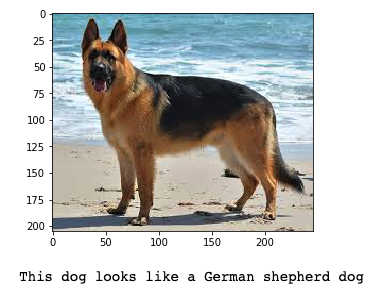

# Dog Breed Classifier, Udacity Capstone

## Project Overview

The project involves developing an algorithm to identify the dog breed of a dog in a user supplied image. In addition to correctly identiftying images of dogs, the algorithm can also be utilised to return what dog breed a human most resembles.
This was my final capstone project in the Udacity Machine learning engineer nanodegree. Below are some example outputs from the completed algorithm.

 
 
 
 

**dog_app.ipynb**
* Conotains all the code for the project

**Notebook 2: Feature Engineering**

* Clean and pre-process the text data.
* Define features for comparing the similarity of an answer text and a source text, and extract similarity features.
* Select "good" features, by analyzing the correlations between different features.
* Create train/test `.csv` files that hold the relevant features and class labels for train/test data points.

**Notebook 3: Train and Deploy Your Model in SageMaker**

* Upload your train/test feature data to S3.
* Define a binary classification model and a training script.
* Train your model and deploy it using SageMaker.
* Evaluate your deployed classifier.

---

Please see the [README](https://github.com/udacity/ML_SageMaker_Studies/tree/master/README.md) in the root directory for instructions on setting up a SageMaker notebook and downloading the project files (as well as the other notebooks).

